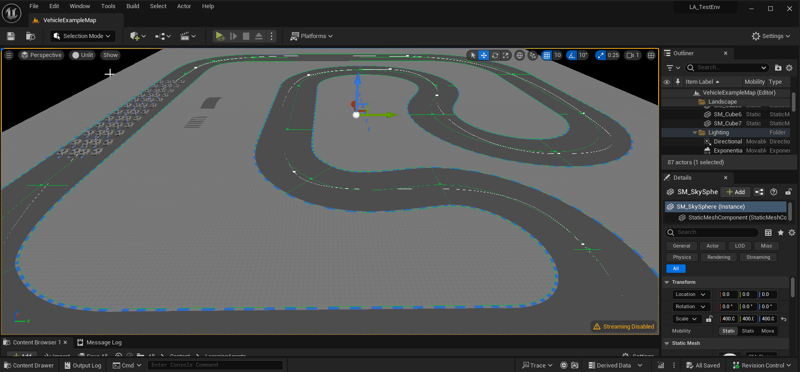
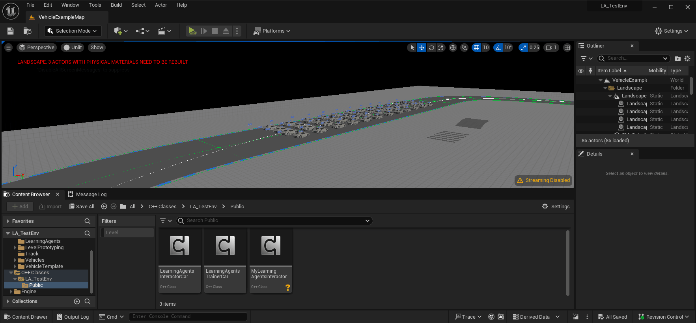

# Unreal Engine 5.3 Learning Agents: How to setup Machine Learning with C++ in Unreal Engine

Unreal Engine released a plugin called Learning Agents. Its still in beta and there arent' many recoures on it yet.

Unreal Engine released a [Basic Introduction Tutorial](https://dev.epicgames.com/community/learning/tutorials/qj2O/unreal-engine-learning-to-drive) .This project is building the same project but with C++ and then is exapanding upon this. The tutorial only goes over basic Reinforcement learning with blueprints.

In this write up i will explain how to setup

* Basic Reinforcement learning with c++
* Imitation learning
  * Recording
  * Inference
  * Deploying the recorded network
* Combine the neural networks with a behavior tree  to combine best of both worlds

## Initial Setup

First create a new Unreal Engine project with version 5.3 or higher. You should make a C++ project to be able to follow this write up.

Then we need to enable the plugin and add private and public DependencyModuleNames

### Enable the plugin



After Enabeling the plugin you will be prompted to restart Unreal Engine, You should do so.

### Adding Private and Public Dependencies to the project

If we want to work with C++ we should add the Dependencies to the YourProjectName.Build.cs file. This gets generated when you solution is made.

Open up the solution with your prefered IDE and navigate to the Build.cs file. This should be located in the root of your project.

[Here](/Source/La_TestEnv/LA_TestEnv.Build.cs) we add the dependencies.

```c#
PrivateDependencyModuleNames.AddRange(new string[] { "LearningAgentsTraining", "ChaosVehicles" });
PublicDependencyModuleNames.AddRange(new string[] {  "LearningAgents", "LearningAgentsTraining"  });
```

Note that i also added ChaosVehicles this is used to give the cars input trough c++. If you are not working with the Car template or not using a Vehicle Movement Componet you should not add this.

## Manager Component Layout

This plugin uses a component layout.

You will create a manager for each type of learning or actions you want to do.

The base class of each manager is a ```ALearningAgentsManager``` which is derived from a ```AActor```

Our Manager basicly can hold our ```ULearningAgentsManagerComponent```

Note: These components are derived from a ```UActorComponent``` and not ```USceneComponent```

Altough our components need to be attached to the manager to be able to work (because or manager does not really store the components but our components hold a pointer to our Manager).

```cpp
void ULearningAgentsManagerComponent::PostInitProperties()
{
	Super::PostInitProperties();

	if (HasAnyFlags(RF_ClassDefaultObject | RF_ArchetypeObject))
	{
		return;
	}

	Manager = GetOwner<ALearningAgentsManager>();

	if (!Manager)
	{
		UE_LOG(LogLearning, Error, TEXT("%s: Must be attached to a LearningAgentsManager Actor."), *GetName());
	}
}
```

For this reason i decided to make the managers in blueprint as they are basicly emtpy vesels  with minimal setup. That way our C++ componets are attached to it without any big problems.

## Basic Reinforcement Learning

What components do we need for a basic Reinforcement Learning setup?

* An Interactor (Observe Data and Apply Actions)
* A Trainer (Give rewards And Execute Completions)
* A Policy

I will now go over each Component and explain what it is used for set it up for my use case


---


### [Interactor](Source/LA_TestEnv/Private/LearningAgentsInteractorCar.cpp)

The interactor Component will be used to:

* Setup Observations
* Set those Observations
* Setup Actions
* Apply those Actions

#### Create the Interactor Component



#### Implementing our Interactor

When our component is added to the project. Open it up in your favourite IDE and we will start with overriding the needed functions in the header file.

We will override  the functions that are specified for the above mentioned jobs.

```cpp
	virtual void SetupObservations_Implementation() override;
	virtual void SetObservations_Implementation(const TArray<int32>& AgentIds) override;

	virtual void SetupActions_Implementation() override;
	virtual void GetActions_Implementation(const TArray<int32>& AgentIds) override;
```

##### SetupObservations_Implementations()

Here we want to setup what our neural network is going to observe in the world, This can be any type of datat we want.

All Possible Observation class can be found in LearningAgentsObservations.cpp

In my case i want to observe the car's:

* Position
* Direction
* Angle to the track
* Velocity
* Distance from the middle of the track

```cpp
void ULearningAgentsInteractorCar::SetupObservations_Implementation()
{
	Super::SetupObservations_Implementation();

	//Planar Observations
	CarPositionOnTrackObservation = UPlanarPositionObservation::AddPlanarPositionObservation(this, TEXT("Car Position On Track"));
	CarDirectionOnTrackObservation = UPlanarDirectionObservation::AddPlanarDirectionObservation(this, TEXT("Car Direction On Track"));
	TrackGlobalAngleObservation = UAngleObservation::AddAngleObservation(this, TEXT("Track Global Angle"));
	CarVelocityObservation = UPlanarVelocityObservation::AddPlanarVelocityObservation(this, TEXT("Car Velocity"));
	CarDistanceToTrackObservation = UFloatObservation::AddFloatObservation(this, TEXT("Car Distance To Track"),1000.f);

	//Helper Observations
	TrackSplineHelper = USplineComponentHelper::AddSplineComponentHelper(this, TEXT("Track Spline Helper"));
}
```

As you can see each observation takes a pointer to the Interactor. Also a TEXT() is passed this is just for debugging.

We can also pass a float to most Observations this will have the name ```scale``` This is used to normailze the data for the observations.

Any helper components that we should need will also be setup here. I would need a ```USplineComponentHelper``` in the future so i also set it up here.

At last we store the created  observations and helpers as private members in our header.

```cpp
//Observations 
UPROPERTY(VisibleDefaultsOnly, Category = "Observations")
UPlanarPositionObservation* CarPositionOnTrackObservation;

UPROPERTY(VisibleDefaultsOnly, Category = "Observations")
UPlanarDirectionObservation* CarDirectionOnTrackObservation;

UPROPERTY(VisibleDefaultsOnly, Category = "Observations")
UAngleObservation* TrackGlobalAngleObservation;

UPROPERTY(VisibleDefaultsOnly, Category = "Observations")
UPlanarVelocityObservation* CarVelocityObservation;

UPROPERTY(VisibleDefaultsOnly, Category = "Observations")
UFloatObservation* CarDistanceToTrackObservation;

//Helpers
UPROPERTY(VisibleDefaultsOnly, Category = "Observations")
USplineComponentHelper* TrackSplineHelper;
```

##### SetObservations_Implementation(const TArray<int32>& AgentIds)

In this function we set the values of those obeservations So first we need to make sure we have access to all the data we need to observe.

I would need access to the track so  i made a spline that follows the track. I make a new ```USplineComponent*``` member in the header that we can set in Blueprints later. This will be the pointer to the track spline

```cpp
UPROPERTY(VisibleDefaultsOnly, Category = "Spline")
USplineComponent* TrackSpline;
```

As you can see a TArray<int32>& AgentIdsis passed as parameter. this will be the id for every agent the neural network is training on.

Now that i have access to every piece of data i want to observe i am going to set my observations

```cpp
void ULearningAgentsInteractorCar::SetObservations_Implementation(const TArray<int32>& AgentIds)
{
	Super::SetObservations_Implementation(AgentIds);
	verify(TrackSpline->IsValidLowLevel())

	for (const int32 AgentId : AgentIds)
	{
		//Get the car and check if its valid
		const AActor* carAgent =  CastChecked<AActor>(GetAgent(AgentId));
		check(carAgent->IsValidLowLevel())
		if(!carAgent->IsValidLowLevel()) continue;

		//get data of the car
		const FVector carLocation = carAgent->GetActorLocation();
		const FRotator carRotation = carAgent->GetActorRotation();
		const FVector carVelocity = carAgent->GetVelocity();

		//get data of the spline
		const float distanceAlongSplineAtPosition = TrackSplineHelper->GetDistanceAlongSplineAtPosition(AgentId, TrackSpline, carLocation);
		const FVector splineLocationAtDistance = TrackSplineHelper->GetPositionAtDistanceAlongSpline(AgentId, TrackSpline, distanceAlongSplineAtPosition);

		const FVector splineDirectionAtDistance = TrackSplineHelper->GetDirectionAtDistanceAlongSpline(AgentId, TrackSpline, distanceAlongSplineAtPosition);

		const float proportionAlongSplineAsAngle = TrackSplineHelper->GetProportionAlongSplineAsAngle(AgentId, TrackSpline, distanceAlongSplineAtPosition);
		const FVector nearestSplineLocation = TrackSplineHelper->GetNearestPositionOnSpline(AgentId, TrackSpline, carLocation);


		//Set The Actual Observations
		CarPositionOnTrackObservation->SetPlanarPositionObservation(AgentId, splineLocationAtDistance, carLocation, carRotation);
		CarDirectionOnTrackObservation->SetPlanarDirectionObservation(AgentId, splineDirectionAtDistance, carRotation);
		TrackGlobalAngleObservation->SetAngleObservation(AgentId, proportionAlongSplineAsAngle);
		CarVelocityObservation->SetPlanarVelocityObservation(AgentId, carVelocity);
		CarDistanceToTrackObservation->SetFloatObservation(AgentId, FVector::Dist(carLocation, nearestSplineLocation));
	}
}
```

##### SetupActions_Implementation()

Now that we have a basic understanding how everything works weh can do the same for the Actions. We can find all possible Actions in LearningAgentsActions.cpp

Storing the actions as members:

```cpp
//Actions
UPROPERTY(VisibleDefaultsOnly, Category = "Actions")
UFloatAction* CarThrottleAction;

UPROPERTY(VisibleDefaultsOnly, Category = "Actions")
UFloatAction* CarBrakeAction;

UPROPERTY(VisibleDefaultsOnly, Category = "Actions")
UFloatAction* SteeringAction;
```

Now that our header is filed in we can assign the actions.

```cpp
void ULearningAgentsInteractorCar::SetupActions_Implementation()
{
	Super::SetupActions_Implementation();

	CarThrottleAction = UFloatAction::AddFloatAction(this, TEXT("Throttle"), 2.f);
	CarBrakeAction = UFloatAction::AddFloatAction(this, TEXT("Brake"), 0.1f);
	SteeringAction = UFloatAction::AddFloatAction(this, TEXT("Steering"), 2.f);
}
```

##### SetActions_Implementation(const TArray<int32>& AgentIds)

Now we actually need to perform the actions. The actions will be generated based upon the observations. In my case i waill pass the actions to the VehicleMovementComponent

```cpp
void ULearningAgentsInteractorCar::GetActions_Implementation(const TArray<int32>& AgentIds)
{
	Super::GetActions_Implementation(AgentIds);
	for (const int32 AgentId : AgentIds)
	{
		const AActor* carAgent =  CastChecked<AActor>(GetAgent(AgentId));
		check(carAgent->IsValidLowLevel())
		if(!carAgent->IsValidLowLevel()) continue;

		const float throttleValue = CarThrottleAction->GetFloatAction(AgentId);
		const float brakeValue = CarBrakeAction->GetFloatAction(AgentId);
		const float steeringValue = SteeringAction->GetFloatAction(AgentId);

		//Apply the value's to the movement component of the actor
		 UChaosVehicleMovementComponent* vehMovementComponent = carAgent->FindComponentByClass<UChaosVehicleMovementComponent>();
		 check(vehMovementComponent->IsValidLowLevel())
		 if(!vehMovementComponent->IsValidLowLevel()) continue;
		 
                 vehMovementComponent->SetThrottleInput(throttleValue);
		 vehMovementComponent->SetBrakeInput(brakeValue);
		 vehMovementComponent->SetSteeringInput(steeringValue);
	}
}
```

---


### [Trainer](Source/LA_TestEnv/Private/LearningAgentsTrainerCar.cpp)

The trainer is used to set rewards and completions for our neural network. It should:

* Setup Rewards
* Give Those Rewards
* Setup When a run is Complete
* Activate these Completions

---


### Policy

My learning environment for testing out Unreal Learning Agents
As of now i am exploring Reinforcement learning and Imitation Learning.

Explain how to implement the system in c++

Explain what each component does and why you would need it

We have our manager which contains our own implementation of a Interactor component

We need to setup the observations for our interactor. (Show the classes in LearningAgentsObservations.h) They each hold a static function to add a observation

The same for Actions, Show the Static function sin LearningAgentsActions.h

Same for LearningAgentsRewards.h

Same for class ULearningAgentsCompletion

We should have visual Loging?

```
#if UE_LEARNING_AGENTS_ENABLE_VISUAL_LOG
	/** Color used to draw this action in the visual log */
	FLinearColor VisualLogColor = FColor::Blue;

	/** Describes this action to the visual logger for debugging purposes. */
	virtual void VisualLog(const UE::Learning::FIndexSet Instances) const {}
#endif
```

Then show the learning agents helper (LearningAgentsHelpser.h) here are the helper functions stored and they also use a static function.

Explain why you would use Imitation learning for certain types of games

Explain why you would learn Reinforcement learning for other types of games

Add Behavior tree support.

Why would we add behaviour tree support?

Behaviour trees are good at a high level support for giving directives

Some sub behaviours would be silly to train the neural network for. This mostly applies for actions that have a hard "When to fire this behaiour".

A good way would be to implement the trained network further down the behaviour tree, For example.

train a neural network for enemies to fight with a human like behaviour, And when the enemy should fight in the behaviour tree then use the neural network
