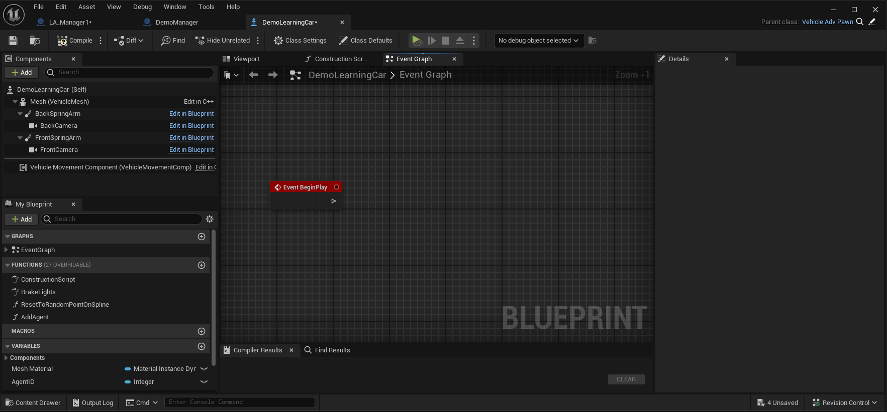

# Unreal Engine 5.3 Learning Agents: How to setup Machine Learning with C++ in Unreal Engine

Unreal Engine released a plugin called Learning Agents. Its still in beta and there arent' many recoures on it yet.

Unreal Engine released a [Basic Introduction Tutorial](https://dev.epicgames.com/community/learning/tutorials/qj2O/unreal-engine-learning-to-drive) .This project is building the same project but with C++ and then is exapanding upon this. The tutorial only goes over basic Reinforcement learning with blueprints.

In this write up i will explain how to setup

* Basic Reinforcement learning with c++
* Imitation learning
  * Recording
  * Inference
  * Deploying the recorded network
* Combine the neural networks with a behavior tree  to combine best of both worlds

---


## Table of Contents

- [Initial Setup](https://github.com/XanderBert/Unreal-Engine-Learning-Agents-Learning-Environment?tab=readme-ov-file#initial-setup)
- [Manager Component Layout](https://github.com/XanderBert/Unreal-Engine-Learning-Agents-Learning-Environment?tab=readme-ov-file#manager-component-layout)
- [Basic Reinforcement Learning](https://github.com/XanderBert/Unreal-Engine-Learning-Agents-Learning-Environment?tab=readme-ov-file#basic-reinforcement-learning)
  - [Interactor](https://github.com/XanderBert/Unreal-Engine-Learning-Agents-Learning-Environment?tab=readme-ov-file#interactor)
  - [Trainer](https://github.com/XanderBert/Unreal-Engine-Learning-Agents-Learning-Environment?tab=readme-ov-file#trainer)
  - [Policy](https://github.com/XanderBert/Unreal-Engine-Learning-Agents-Learning-Environment?tab=readme-ov-file#policy)
  - [Setup The Reinforcement Learning Manager](https://github.com/XanderBert/Unreal-Engine-Learning-Agents-Learning-Environment?tab=readme-ov-file#setup-the-reinforcement-learning-manager)
  - [Registering The Agents](https://github.com/XanderBert/Unreal-Engine-Learning-Agents-Learning-Environment?tab=readme-ov-file#register-the-agents)
  - [Create A Neural Netork Asset](https://github.com/XanderBert/Unreal-Engine-Learning-Agents-Learning-Environment?tab=readme-ov-file#create-a-neural-network-data-type)
- Basic Imitation Learning
  - Recorder
  -

---


## Initial Setup

First create a new Unreal Engine project with version 5.3 or higher. You should make a C++ project to be able to follow this write up.

Then we need to enable the plugin and add private and public DependencyModuleNames

### Enable the plugin


After Enabeling the plugin you will be prompted to restart Unreal Engine, You should do so.

### Adding Private and Public Dependencies to the project

If we want to work with C++ we should add the Dependencies to the YourProjectName.Build.cs file. This gets generated when you solution is made.

Open up the solution with your prefered IDE and navigate to the Build.cs file. This should be located in the root of your project.

[Here](/Source/La_TestEnv/LA_TestEnv.Build) we add the dependencies.

```c#
PrivateDependencyModuleNames.AddRange(new string[] { "LearningAgentsTraining", "ChaosVehicles" });
PublicDependencyModuleNames.AddRange(new string[] {  "LearningAgents", "LearningAgentsTraining"  });
```

Note that i also added ChaosVehicles this is used to give the cars input trough c++. If you are not working with the Car template or not using a Vehicle Movement Componet you should not add this.

## Manager Component Layout

This plugin uses a component layout.

You will create a manager for each type of learning or actions you want to do.

The base class of each manager is a ```ALearningAgentsManager``` which is derived from a ```AActor```

Our Manager basicly can hold our ```ULearningAgentsManagerComponent```

Note: These components are derived from a ```UActorComponent``` and not ```USceneComponent```

Altough our components need to be attached to the manager to be able to work (because or manager does not really store the components but our components hold a pointer to our Manager).

```cpp
void ULearningAgentsManagerComponent::PostInitProperties()
{
	Super::PostInitProperties();

	if (HasAnyFlags(RF_ClassDefaultObject | RF_ArchetypeObject))
	{
		return;
	}

	Manager = GetOwner<ALearningAgentsManager>();

	if (!Manager)
	{
		UE_LOG(LogLearning, Error, TEXT("%s: Must be attached to a LearningAgentsManager Actor."), *GetName());
	}
}
```

For this reason i decided to make the managers in blueprint as they are basicly emtpy vesels  with minimal setup. That way our C++ componets are attached to it without any big problems.

## Basic Reinforcement Learning

What components do we need for a basic Reinforcement Learning setup?

* An Interactor (Observe Data and Apply Actions)
* A Trainer (Give rewards And Execute Completions)
* A Policy (Decides What the agent does with the given Observations)

I will now go over each Component and explain what it is used for set it up for my use case

---

### [Interactor](Source/LA_TestEnv/Private/LearningAgentsInteractorCar.cpp)

The interactor Component will be used to:

* Setup Observations
* Set those Observations
* Setup Actions
* Apply those Actions

#### Create the Interactor Component


#### Implementing our Interactor

When our component is added to the project. Open it up in your favourite IDE and we will start with overriding the needed functions in the header file.

We will override  the functions that are specified for the above mentioned jobs.

```cpp
	virtual void SetupObservations_Implementation() override;
	virtual void SetObservations_Implementation(const TArray<int32>& AgentIds) override;

	virtual void SetupActions_Implementation() override;
	virtual void GetActions_Implementation(const TArray<int32>& AgentIds) override;
```

##### Setup Observations

Here we want to setup what our neural network is going to observe in the world, This can be any type of datat we want.

All Possible Observation class can be found in LearningAgentsObservations.cpp

In my case i want to observe the car's:

* Position
* Direction
* Angle to the track
* Velocity
* Distance from the middle of the track

```cpp
void ULearningAgentsInteractorCar::SetupObservations_Implementation()
{
	Super::SetupObservations_Implementation();

	//Planar Observations
	CarPositionOnTrackObservation = UPlanarPositionObservation::AddPlanarPositionObservation(this, TEXT("Car Position On Track"));
	CarDirectionOnTrackObservation = UPlanarDirectionObservation::AddPlanarDirectionObservation(this, TEXT("Car Direction On Track"));
	TrackGlobalAngleObservation = UAngleObservation::AddAngleObservation(this, TEXT("Track Global Angle"));
	CarVelocityObservation = UPlanarVelocityObservation::AddPlanarVelocityObservation(this, TEXT("Car Velocity"));
	CarDistanceToTrackObservation = UFloatObservation::AddFloatObservation(this, TEXT("Car Distance To Track"),1000.f);

	//Helper Observations
	TrackSplineHelper = USplineComponentHelper::AddSplineComponentHelper(this, TEXT("Track Spline Helper"));
}
```

As you can see each observation takes a pointer to the Interactor. Also a TEXT() is passed this is just for debugging.

We can also pass a float to most Observations this will have the name ```scale``` This is used to normailze the data for the observations.

Any helper components that we should need will also be setup here. I would need a ```USplineComponentHelper``` in the future so i also set it up here.

At last we store the created  observations and helpers as private members in our header.

```cpp
//Observations 
UPROPERTY(VisibleDefaultsOnly, Category = "Observations")
UPlanarPositionObservation* CarPositionOnTrackObservation;

UPROPERTY(VisibleDefaultsOnly, Category = "Observations")
UPlanarDirectionObservation* CarDirectionOnTrackObservation;

UPROPERTY(VisibleDefaultsOnly, Category = "Observations")
UAngleObservation* TrackGlobalAngleObservation;

UPROPERTY(VisibleDefaultsOnly, Category = "Observations")
UPlanarVelocityObservation* CarVelocityObservation;

UPROPERTY(VisibleDefaultsOnly, Category = "Observations")
UFloatObservation* CarDistanceToTrackObservation;

//Helpers
UPROPERTY(VisibleDefaultsOnly, Category = "Observations")
USplineComponentHelper* TrackSplineHelper;
```

##### Set Observations

In this function we set the values of those obeservations So first we need to make sure we have access to all the data we need to observe.

I would need access to the track so  i made a spline that follows the track. I make a new ```USplineComponent*``` member in the header that we can set in Blueprints later. This will be the pointer to the track spline

```cpp
UPROPERTY(VisibleDefaultsOnly, Category = "Spline")
USplineComponent* TrackSpline;
```

As you can see a TArray<int32>& AgentIdsis passed as parameter. this will be the id for every agent the neural network is training on.

Now that i have access to every piece of data i want to observe i am going to set my observations

```cpp
void ULearningAgentsInteractorCar::SetObservations_Implementation(const TArray<int32>& AgentIds)
{
	Super::SetObservations_Implementation(AgentIds);
	verify(TrackSpline->IsValidLowLevel())

	for (const int32 AgentId : AgentIds)
	{
		//Get the car and check if its valid
		const AActor* carAgent =  CastChecked<AActor>(GetAgent(AgentId));
		check(carAgent->IsValidLowLevel())
		if(!carAgent->IsValidLowLevel()) continue;

		//get data of the car
		const FVector carLocation = carAgent->GetActorLocation();
		const FRotator carRotation = carAgent->GetActorRotation();
		const FVector carVelocity = carAgent->GetVelocity();

		//get data of the spline
		const float distanceAlongSplineAtPosition = TrackSplineHelper->GetDistanceAlongSplineAtPosition(AgentId, TrackSpline, carLocation);
		const FVector splineLocationAtDistance = TrackSplineHelper->GetPositionAtDistanceAlongSpline(AgentId, TrackSpline, distanceAlongSplineAtPosition);

		const FVector splineDirectionAtDistance = TrackSplineHelper->GetDirectionAtDistanceAlongSpline(AgentId, TrackSpline, distanceAlongSplineAtPosition);

		const float proportionAlongSplineAsAngle = TrackSplineHelper->GetProportionAlongSplineAsAngle(AgentId, TrackSpline, distanceAlongSplineAtPosition);
		const FVector nearestSplineLocation = TrackSplineHelper->GetNearestPositionOnSpline(AgentId, TrackSpline, carLocation);


		//Set The Actual Observations
		CarPositionOnTrackObservation->SetPlanarPositionObservation(AgentId, splineLocationAtDistance, carLocation, carRotation);
		CarDirectionOnTrackObservation->SetPlanarDirectionObservation(AgentId, splineDirectionAtDistance, carRotation);
		TrackGlobalAngleObservation->SetAngleObservation(AgentId, proportionAlongSplineAsAngle);
		CarVelocityObservation->SetPlanarVelocityObservation(AgentId, carVelocity);
		CarDistanceToTrackObservation->SetFloatObservation(AgentId, FVector::Dist(carLocation, nearestSplineLocation));
	}
}
```

##### Setup Actions

Now that we have a basic understanding how everything works weh can do the same for the Actions. We can find all possible Actions in LearningAgentsActions.cpp

Storing the actions as members:

```cpp
//Actions
UPROPERTY(VisibleDefaultsOnly, Category = "Actions")
UFloatAction* CarThrottleAction;

UPROPERTY(VisibleDefaultsOnly, Category = "Actions")
UFloatAction* CarBrakeAction;

UPROPERTY(VisibleDefaultsOnly, Category = "Actions")
UFloatAction* SteeringAction;
```

Now that our header is filed in we can assign the actions.

```cpp
void ULearningAgentsInteractorCar::SetupActions_Implementation()
{
	Super::SetupActions_Implementation();

	CarThrottleAction = UFloatAction::AddFloatAction(this, TEXT("Throttle"), 2.f);
	CarBrakeAction = UFloatAction::AddFloatAction(this, TEXT("Brake"), 0.1f);
	SteeringAction = UFloatAction::AddFloatAction(this, TEXT("Steering"), 2.f);
}
```

##### Set Actions

Now we actually need to perform the actions. The actions will be generated based upon the observations. In my case i waill pass the actions to the VehicleMovementComponent

```cpp
void ULearningAgentsInteractorCar::GetActions_Implementation(const TArray<int32>& AgentIds)
{
	Super::GetActions_Implementation(AgentIds);
	for (const int32 AgentId : AgentIds)
	{
		const AActor* carAgent =  CastChecked<AActor>(GetAgent(AgentId));
		check(carAgent->IsValidLowLevel())
		if(!carAgent->IsValidLowLevel()) continue;

		const float throttleValue = CarThrottleAction->GetFloatAction(AgentId);
		const float brakeValue = CarBrakeAction->GetFloatAction(AgentId);
		const float steeringValue = SteeringAction->GetFloatAction(AgentId);

		//Apply the value's to the movement component of the actor
		 UChaosVehicleMovementComponent* vehMovementComponent = carAgent->FindComponentByClass<UChaosVehicleMovementComponent>();
		 check(vehMovementComponent->IsValidLowLevel())
		 if(!vehMovementComponent->IsValidLowLevel()) continue;
		 
                 vehMovementComponent->SetThrottleInput(throttleValue);
		 vehMovementComponent->SetBrakeInput(brakeValue);
		 vehMovementComponent->SetSteeringInput(steeringValue);
	}
}
```

---

### [Trainer](Source/LA_TestEnv/Private/LearningAgentsTrainerCar.cpp)

The trainer is used to set rewards and completions for our neural network. It should:

* Setup Rewards
* Give Those Rewards
* Setup When a run is Complete
* Activate these Completions

#### Create the Trainer Component


#### Implementing our Trainer

We will override these functions to set rewards, completions and to reset an agent

```cpp
virtual void SetupRewards_Implementation() override;
virtual void SetRewards_Implementation(const TArray<int32>& AgentIds) override;

virtual void SetupCompletions_Implementation() override;
virtual void SetCompletions_Implementation(const TArray<int32>& AgentIds) override;

virtual void ResetEpisodes_Implementation(const TArray<int32>& AgentIds) override;
```

##### Setup Rewards

Here we decide how the agent can get 'points' In my case i will give him points for Velocity and how far he is from the spline. Speaking of the spline i will probably will need a 'USplineComponentHelper'

Again All our Rewards are stored in 1 file: ```LearningAgentsRewards.cpp```

First we make the members:

```cpp
//Helpers
UPROPERTY(VisibleDefaultsOnly, Category = "Spline")
USplineComponentHelper* TrackSplineHelper;

//Rewards
UPROPERTY(VisibleDefaultsOnly, Category = "Rewards")
UScalarVelocityReward* VelocityReward;

UPROPERTY(VisibleDefaultsOnly, Category = "Rewards")
UFloatReward* DistanceReward;
```

Then we Setup those rewards:

```cpp
void ULearningAgentsTrainerCar::SetupRewards_Implementation()
{
	Super::SetupRewards_Implementation();

	TrackSplineHelper = USplineComponentHelper::AddSplineComponentHelper(this, TEXT("Track Spline Helper"));

	//Rewards
	VelocityReward = UScalarVelocityReward::AddScalarVelocityReward(this, TEXT("Velocity Reward"));
	DistanceReward = UFloatReward::AddFloatReward(this, TEXT("Distance Reward"), 1.f);
}
```

##### Set Rewards

Now we will decide when we give Rewards/Penaltys and how big those are

```cpp
void ULearningAgentsTrainerCar::SetRewards_Implementation(const TArray<int32>& AgentIds)
{
	Super::SetRewards_Implementation(AgentIds);

	for (const int32 AgentId : AgentIds)
	{
		const AActor* carActor = CastChecked<AActor>(GetAgent(AgentId));
		check(carActor->IsValidLowLevel())

		const FVector carVelocity = carActor->GetVelocity();
		const FVector carLocation = carActor->GetActorLocation();

		const float velocityAlongSpline = TrackSplineHelper->GetVelocityAlongSpline(AgentId, TrackSpline, carLocation, carVelocity);
		const FVector closestPointOnSpline = TrackSplineHelper->GetNearestPositionOnSpline(AgentId, TrackSpline, carLocation);
		const float distanceToSpline = FVector::Distance(carLocation, closestPointOnSpline);


		//The closer from the spline the bigger the reward
		//When we go over 100.f we start to penalize the agent big time
		const float closeReward = UKismetMathLibrary::MapRangeClamped(distanceToSpline, 100.1f, 1800.f, 0.f, -4.5f);
		const float farReward = UKismetMathLibrary::MapRangeClamped(distanceToSpline, 0.f, 100.f, 1.f, 0.f);
		const float distanceReward = UKismetMathLibrary::SelectFloat(closeReward, farReward, distanceToSpline >= 100.1f);

		//Set Rewards
		DistanceReward->SetFloatReward(AgentId, distanceReward);
		VelocityReward->SetScalarVelocityReward(AgentId, velocityAlongSpline);
	}
}
```

##### Setup Completions

Here we dicide the condition for the the agent to be "reset".

All Completion types can be found in ```LearningAgentsCompletions.cpp```

Again we store this as a member to use later

```cpp
	//Completions
	UPROPERTY(VisibleDefaultsOnly, Category = "Completions")
	UPlanarPositionDifferenceCompletion* OffTrackCompletion;
```

Now th actual implementation. In my case it will be a simple distance. When the distance between points is bigger then 1200.f the Resetting will fire.

```cpp
void ULearningAgentsTrainerCar::SetupCompletions_Implementation()
{
	Super::SetupCompletions_Implementation();
	OffTrackCompletion = UPlanarPositionDifferenceCompletion::AddPlanarPositionDifferenceCompletion(this, TEXT("Off Track Completion"),1200.f);
}
```

##### Set Completions

Here we will set the value the completion should have. In my cast the 2 points.

```cpp
void ULearningAgentsTrainerCar::SetCompletions_Implementation(const TArray<int32>& AgentIds)
{
	Super::SetCompletions_Implementation(AgentIds);

	for (const int32 AgentId : AgentIds)
	{
		const AActor* carActor = CastChecked<AActor>(GetAgent(AgentId));
		check(carActor->IsValidLowLevel())

		const FVector carLocation = carActor->GetActorLocation();
		const FVector closestPointOnSpline = TrackSplineHelper->GetNearestPositionOnSpline(AgentId, TrackSpline, carLocation);

		//Set Completions
		OffTrackCompletion->SetPlanarPositionDifferenceCompletion(AgentId, closestPointOnSpline, carLocation);
	}
}
```

##### Reset

Now the last step of the Trainer is the resetting of the agents when the Completion is met.

So for when the car is going offtrack i will place it on a random point on the track.

I use the allready made car blueprint from unreal engine self so i made the function in blueprints. I just call it here in c++ (I don't recommenddoing this! It is for demo purposes only)

```cpp
void ULearningAgentsTrainerCar::ResetEpisodes_Implementation(const TArray<int32>& AgentIds)
{
	Super::ResetEpisodes_Implementation(AgentIds);

	for (const int32 AgentId : AgentIds)
	{
		AActor* carActor = CastChecked<AActor>(GetAgent(AgentId));
		check(carActor->IsValidLowLevel())

		//Set the car on a random point on the spline.
		//Why a random point? Because if we always start at the same point, the agent will learn the way the track goes and the learned data will not be flexible enough.
		FOutputDeviceNull OutputDevice;
		carActor->CallFunctionByNameWithArguments(TEXT("ResetToRandomPointOnSpline"), OutputDevice, NULL, true);
	}
}
```

---

### Policy

A Policy decides what the agent does. It also adds 'noise'. That's a fancy term for it just tries out things and checks if the reward was greater then before.

We don't need to setup this component and only give it some settings in the manager so we can do that in blueprints.

#### Creating the Policy Component


---

### Setup The Reinforcement Learning Manager

The bigest bit of setup is now done. In our manager we just need to register our made components and thats about it for the manager.

1. Create the manager
2. Set the number of agents we want to use and Add the components
   
3. Initialize the components and run training
   
   As you can see we just call Setup for every component. and promote the settings as a member variable.
   Also for now we don't select a neural network asset for the Policy I will cover this a bit later in this write up.
   I will also come back to talk about the Run Training settings.

### Register The Agents

Now with this all setup we want our agents to be registered to our manager. In this demo i did set the Agent Max Num to 32 as shown in step 2 of setting up the manager. You can expiriment with this as you like.

1. Spawn The manager in the level, Just drag the blueprint in the world and you are set
2. Open up your agent you want to train and add it to the manager
   
3. Drag the agent blueprint into the level, You can drag as many in the world as you set the limit in the manager (if you spawn more they just won't be registered in the manager)

### Create a Neural Network Data Type

Last step in setting up Reinforcement Learning is creating the Neural Network and setting as our network asset in the policy inside our manager.

1. Create the Neural Network Data Type
   
2. Select the asset in our manager for our policy
